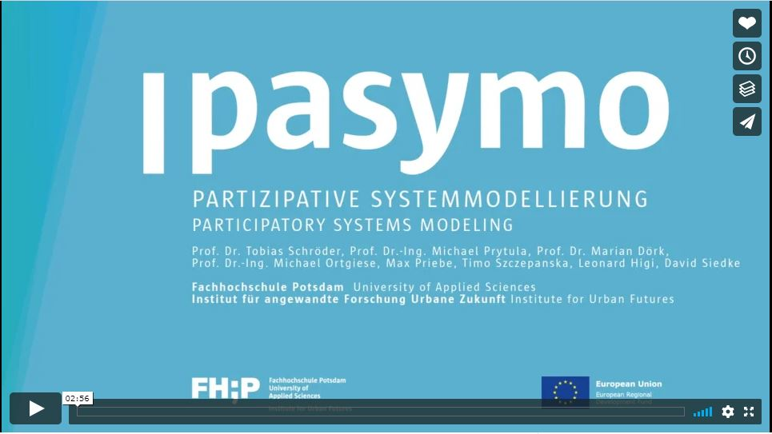

# Hei
### Timo's intro to Bridge
---?image=assets/img/cover.jpg

### Technology and Culture
* BA Culture and Technology at the Technical University of Berlin

* Project manager at NPO in the field of Arts and Cultural Education in Berlin

  * [kubinaut.de](https://www.kubinaut.de/de)
  * [FSJ-Kultur](http://lkj-berlin.de/fsjkultur/)
  * [infonetkalender.de](http://www.infonetkalender.de/)
---

### How to Future?
* MA Future Studies at the Free University of Berlin
  * Agent-based Modeling
  * Semester in SF
  * Conceptualized a Simulation for estimating attitude change processes in teams over time

---
### Institute for Urban Futures
* Research associate and coordinator for the EU-Project PaSyMo at the University of Applied Sciences Potsdam
* Teaching classes on ABM and complex adaptive systems at FH-Potsdam and FU-Berlin

---
@snap[midpoint span-75]

[Start the Video](https://vimeo.com/285110972)
@snapend

---
@snap[south-west span-55]

@snapend

@snap[south-east span-50]

@snapend

@snap[north-west span-50]

@snapend

@snap[north-east span-60]

@snapend

---?color=#E58537
@title[Add A Little Imagination]

@snap[north-west]
#### Add a splash of @color[cyan](**color**) and you are ready to start presenting...
@snapend

@snap[west span-55]
@ul[spaced text-white]
- You will be amazed
- What you can achieve
- *With a little imagination...*
- And **GitPitch Markdown**
@ulend
@snapend

@snap[east span-45]
@img[shadow](assets/img/conference.png)
@snapend

---?image=assets/img/presenter.jpg

@snap[north span-100 headline]
## Now It's Your Turn
@snapend

@snap[south span-100 text-06]
[Click here to jump straight into the interactive feature guides in the GitPitch Docs @fa[external-link]](https://gitpitch.com/docs/getting-started/tutorial/)
@snapend
