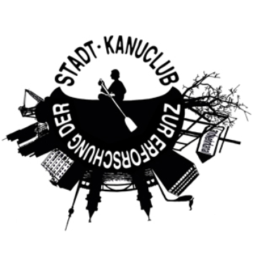
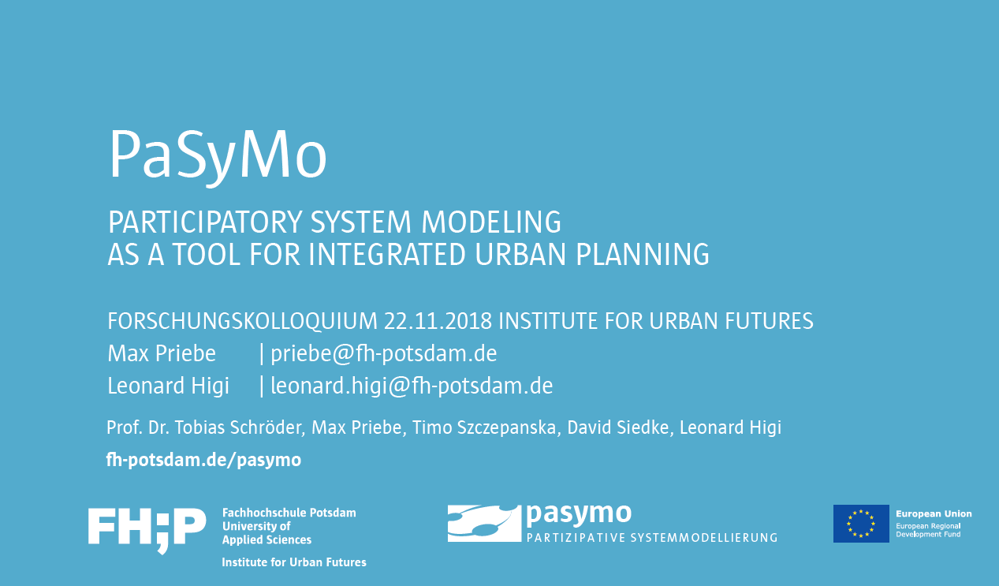
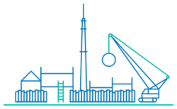
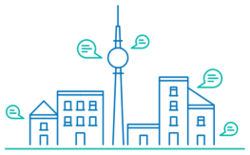
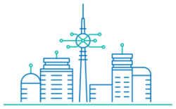
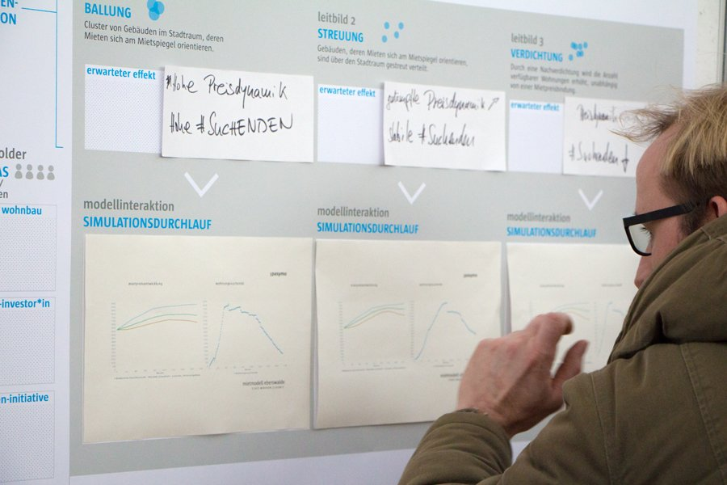
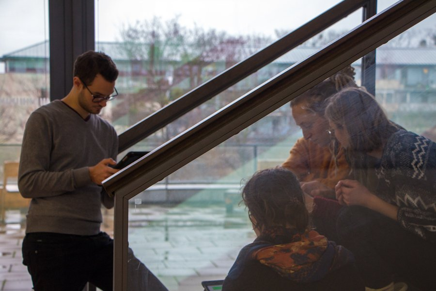
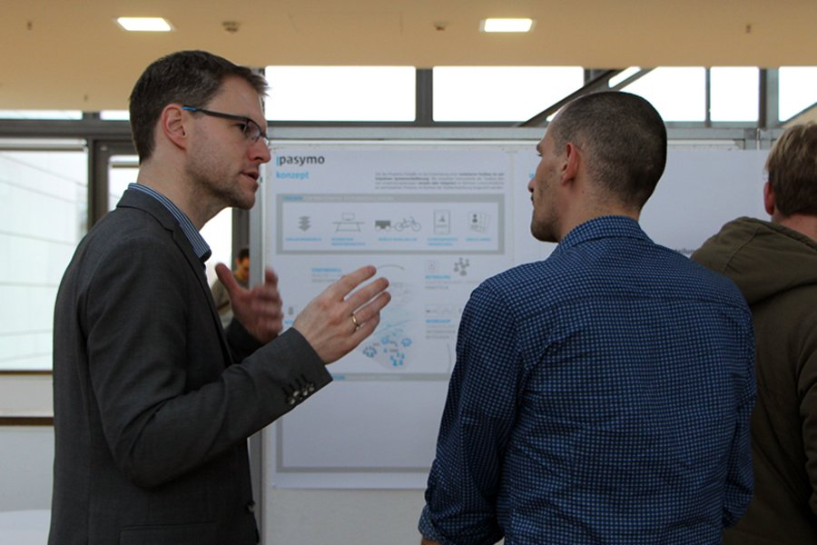
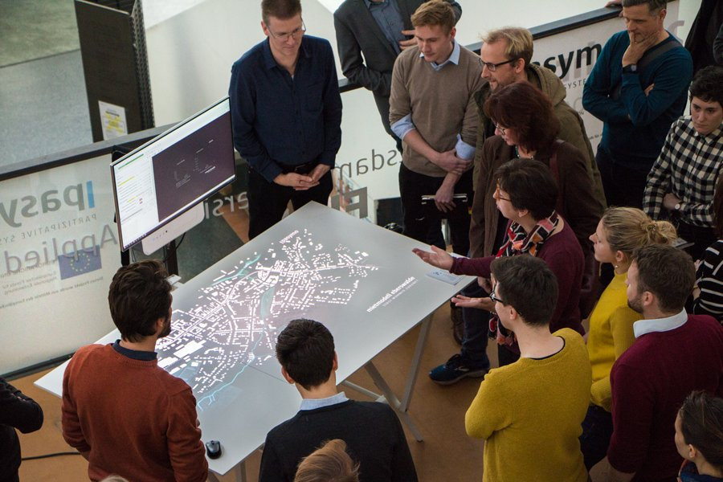

---?image=assets/img/cover.jpg
@snap[midpoint]
@size[3.5em](Hei)
 
*-Background Stories-*
@snapped

---
@title[Technology for Culture]
* BA Culture and Technology at the Technical University of Berlin

* Project manager at a NPO in the field of Arts and Cultural Education in Berlin

  * [kubinaut.de](https://www.kubinaut.de/de)
  * [FSJ-Kultur](http://lkj-berlin.de/fsjkultur/)
  * [infonetkalender.de](http://www.infonetkalender.de/)

  @snap[south-west span-20]
  
  @snapped

  @snap[south]
  
  @snapped

---?image=assets/img/2.jpg&size=cover&opacity=20
@title[How to study the Future?]

* MA Future Studies at the Free University of Berlin
* Agent-based Modeling
* Semester in SF
* Thesis: conceptualized a simulation for estimating attitude change processes in teams over time

---

### Institute for Urban Futures
* Research associate and coordinator for the EU-Project PaSyMo at the University of Applied Sciences of Potsdam
* Teaching classes on ABM and complex adaptive systems at FH-Potsdam and FU-Berlin

@snap[north-west span-20]

@snapend

@snap[north span-20]

@snapend

@snap[north-east span-20]

@snapend

---?image=assets/img/4.jpg

@snap[midpoint span-95 bg-white text-black]
@color[skyblue](Participatory Modeling) aims at facilitating on-side collaborative learning processes by which participants’ implicit mental models of a complex system like a city are made explicit and further integrated in codesigned computer simulations. Ideally, these simulations represent a base of knowledge, assumptions and perceptions that allow participants to assess and discuss potential impacts of envisaged planning actions through visualization.
@snapend

---?image=assets/img/4.jpg

---

---

@snap[midpoint span-100 bg-black]
lf
d
fsd
f
sdf
@snapped
---

@snap[midpoint span-100]
@img[shadow](assets/img/a_Page_01.jpg)
@snapend

---?image=assets/img/a.png

---?image=assets/img/b.png

---?image=assets/img/c.png

---?image=assets/img/c1.png

---?image=assets/img/d.png

---?image=assets/img/e.png

---?image=assets/img/f.png

---?image=assets/img/g.png

---?image=assets/img/h.png

---?image=assets/img/i.png

---?image=assets/img/j.png

---?image=assets/img/k.png

---?image=assets/img/l.png

---
@snap[south-west span-55]

@snapend

@snap[south-east span-50]

@snapend

@snap[north-west span-50]

@snapend

@snap[north-east span-60]

@snapend

---?color=#E58537
@title[END :-)]
