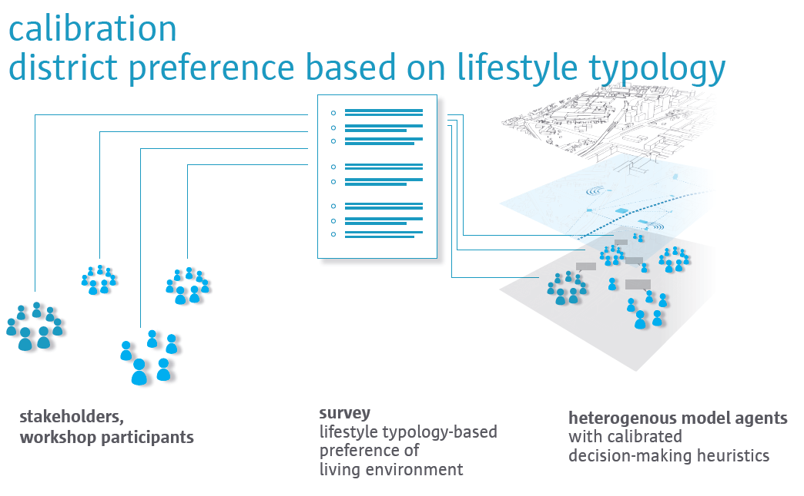
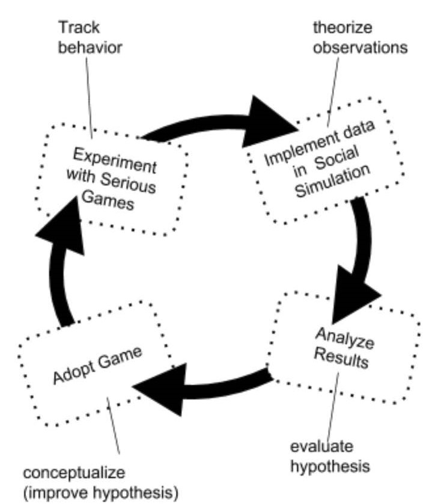

---?image=assets/img/cover.jpg
@snap[south-west]
@size[2.5 em](Timo Szczepanska) 
@size[2.5 em](UiT - Arctic University of Norway) 
@size[2.5 em](Faculty of Biosciences, Fisheries and Economics)
@snapend

---?color=white
### Serious Games as a Research Device for Sustainable Resource Management
 
What can agent-based modeling provide for understanding complex adaptive systems by integrating the multiple perspective of stakeholders in the field of Fisheries Management?

---?color=white
@snap[south-west span-55]

@snapend

@snap[south-east span-50]

@snapend

@snap[north-west span-50]

@snapend

@snap[north-east span-60]

@snapend

---?color=white
@snap[midpoint span-90]

@snapend

---?color=white
@snap[north]
### Serious Games
@snapend

@snap[east span-40]

@snapend

@snap[west span-60]
1. How to set up experimental settings and capture interactions using serious games?
 
2. Utilize serious games as a tool to inform ABM?
@snapend
