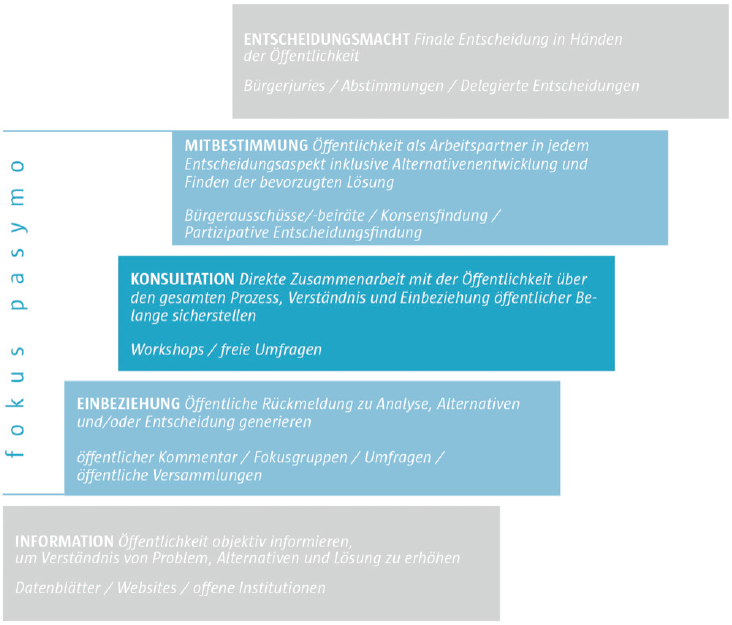
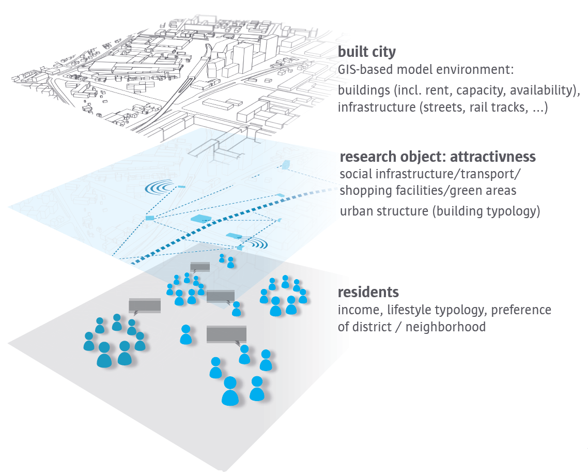
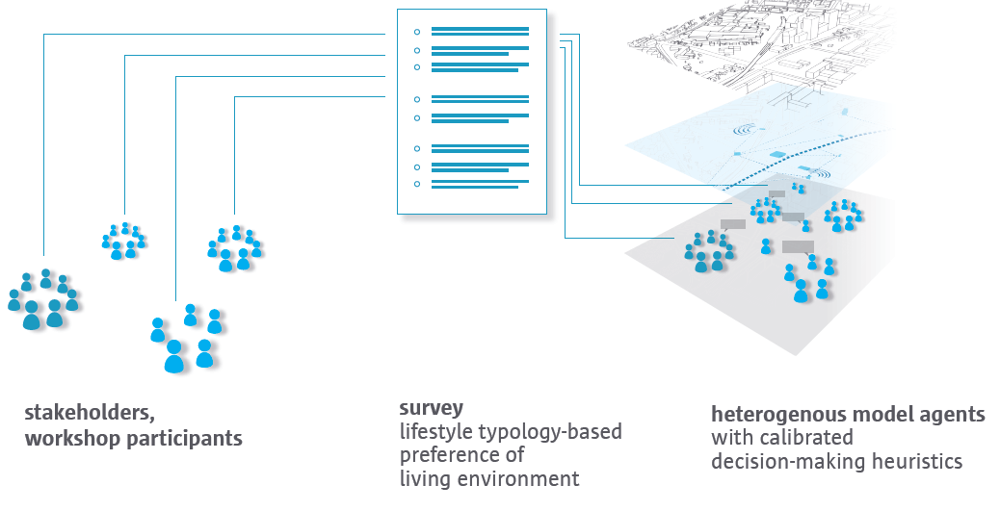

---?image=assets/img/cover.jpg
@snap[midpoint]
@size[3.5em](Hei)
 
*-Background Stories-*
@snapend

---?color=gray
@title[Technology for culture?]
@snap[south-west span-100]

@snapend

@snap[north span-100]
 
@ul
- BA Culture and Technology at the Technical University of Berlin
- Project manager at a NPO in the field of Arts and Cultural Education in Berlin
  - [kubinaut.de](https://www.kubinaut.de/de)
  - [FSJ-Kultur](http://lkj-berlin.de/fsjkultur/)
  - [infonetkalender.de](http://www.infonetkalender.de/)
@ulend
@snapend

---?color=gray
@title[How to study the Future?]
@snap[north span-100]
 
@ul
- MA Future Studies at the Free University of Berlin
  - Agent-based Modeling
  - Semester in SF
  - Thesis: conceptualized a simulation for estimating attitude change processes in Co-Living settings
@ulend
@snapend

@snap[south-west snap-20]
@fa[line-chart fa-3x]
@size[4em](..)
@snapend

@snap[south]
@fa[lightbulb-o fa-3x]
@size[4em](..)
@snapend

@snap[south-east]
@fa[rocket fa-3x]
@size[4em](..)
@snapend

---?color=lightblue
@snap[north span-100]
 
@size[2em](@color[white](Institute for Urban Futures))
@ul
- Research associate and coordinator for the EU-Project PaSyMo at the University of Applied Sciences of Potsdam
- Teaching classes on ABM and complex adaptive systems at FH-Potsdam and FU-Berlin
@ulend
@snapend

@snap[south-west span-25]

@snapend

@snap[south span-25]

@snapend

@snap[south-east span-25]

@snapend

---?color=assets/img/4.jpg
@snap[midpoint span-100]

@snapped

---?color=assets/img/4.jpg

@snap[midpoint span-100 bg-white text-black]
@color[skyblue](Participatory Modeling) aims at facilitating on-side collaborative learning processes by which participants’ implicit mental models of a complex system like a city are made explicit and further integrated in codesigned computer simulations. Ideally, these simulations represent a base of knowledge, assumptions and perceptions that allow participants to assess and discuss potential impacts of envisaged planning actions through visualization.
@snapend

---?image=assets/img/4.jpg

---?color=lightblue
@snap[midpoint span-100 bg-black]

@snapped

---?color=lightblue
@snap[midpoint span-100 bg-black]

@snapped

---?color=lightblue
@snap[midpoint span-100 bg-black]

@snapped

---?color=lightblue
@snap[midpoint span-100 bg-black]

@snapped

---?color=lightblue
@snap[midpoint span-100 bg-black]

@snapped

---?color=lightblue
@snap[midpoint span-100 bg-black]

@snapped

---?color=lightblue
@snap[midpoint span-100 bg-black]

@snapped

---?color=lightblue
@snap[midpoint span-100 bg-black]

@snapped

---?color=lightblue
@snap[midpoint span-100 bg-black]

@snapped

---?color=lightblue
@snap[midpoint span-100 bg-black]

@snapped

---?color=lightblue
@snap[midpoint span-100 bg-black]

@snapped

---?color=lightblue
@snap[midpoint span-100 bg-black]

@snapped

---
### Workshop
twitter.com/Urbane_Zukunft/status/1083029514744143872
@fa[twitter] @Urbane_Zukunft

---
@snap[south-west span-55]

@snapend

@snap[south-east span-50]

@snapend

@snap[north-west span-50]

@snapend

@snap[north-east span-60]

@snapend

---?color=#E58537
@title[END :-)]
