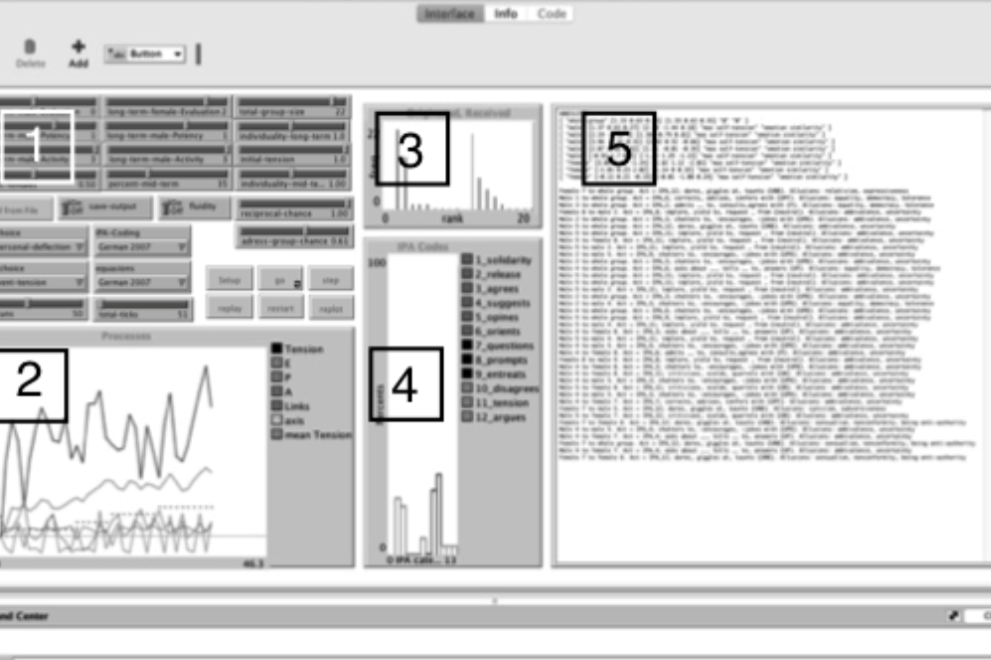
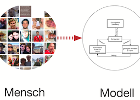

---?image=assets/img/cover.jpg
@snap[midpoint]
@size[3.5em](Hei)
 
*-Background Stories-*
@snapend

---?color=lightgray
@title[Technology for culture?]
@snap[south-west span-100]

@snapend

@snap[north span-100]
 
@ul
- @color[#4badd1](BA Culture and Technology) at the @color[#4badd1](Technical University of Berlin)
- Project manager at a NGO in the field of Arts and Cultural Education in Berlin
  - [kubinaut.de](https://www.kubinaut.de/de)
  - FSJ-Kultur
  - infonetkalender.de]
@ulend
@snapend

---?color=lightgray
@title[How to study the Future?]
@snap[north span-100]
 
@ul
- @color[#4badd1](MA Future Studies) at the @color[#4badd1](Free University of Berlin)
  - Agent-based Modeling
  - Research semester in San Francisco
  - Thesis: conceptualization of a simulation for estimating attitude change processes in co-living environments
@ulend
@snapend

@snap[south-east span-30]

@snapend

@snap[south-west span-30]

@snapend

@snap[south span-30]

@snapend

---?color=#4badd1
@snap[north span-100]
 
@size[1.7em](@color[white](Institute for Urban Futures))
@ul
- Research associate and coordinator for the EU-Project PaSyMo at the University of Applied Sciences of Potsdam
- Teaching classes on ABM and complex adaptive systems at FH-Potsdam and FU-Berlin
@ulend
@snapend

@snap[south-west span-25]

@snapend

@snap[south span-25]

@snapend

@snap[south-east span-45]

@snapend

---?image=assets/img/4.jpg
@snap[midpoint span-100]

@snapped

---?image=assets/img/4.jpg
@snap[midpoint span-95 bg-white text-black]
@color[#4badd1](Participatory Modeling) aims at facilitating on-side collaborative learning processes by which participants’ implicit mental models of a complex system like a city are made explicit and further integrated in codesigned computer simulations. Ideally, these simulations represent a base of knowledge, assumptions and perceptions that allow participants to assess and discuss potential impacts of envisaged planning actions through visualization.
@snapend

---?image=assets/img/4.jpg
@snap[midpoint span-80]

@snapped

---?image=assets/img/4.jpg

---?color=white
@snap[midpoint span-80]

@snapped

---?color=white
@snap[midpoint span-80]

@snapped

---?color=white
@snap[midpoint span-90]

@snapped

---?color=white
@snap[midpoint span-80]

@snapped

---?color=white
@snap[midpoint span-90]

@snapped

---?color=white
@snap[midpoint span-80]

@snapped

---?color=white
@snap[midpoint span-90]

@snapped

---?color=white
@snap[north-west span-75]

@snapped

@snap[south-east span-75]

@snapped

---?color=white
@snap[midpoint span-100]

@snapped

---
### Workshop
twitter.com/Urbane_Zukunft/status/1083029514744143872
@fa[twitter color-skyblue] @Urbane_Zukunft

---
@snap[south-west span-55]

@snapend

@snap[south-east span-50]

@snapend

@snap[north-west span-50]

@snapend

@snap[north-east span-60]

@snapend

---?color=darkred
### Serious Games as a Research Device for Sustainable Resource Management
#### A multi-methodological approach to build a framework for utilizing stakeholder involvement in decision-making processes

---?color=darkred
@snap[north-east span-100]

@snapend
